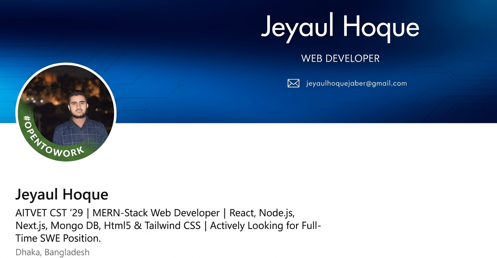

  

# MERN-Stack Web Developer
###  Based in Bangladesh

  
  

---

### 💫 (About Me)
- 👋 Hi, I am **Jeyaul Hoque**, a passionate **web developer** from Bangladesh.
- 🚀 I can do everything needed to create a website—**from frontend to backend**—alhamdulillah.
- 🛠️ I love writing pixel-perfect designs and clean code.
- 🌍 My goal is to create modern and user-friendly web app.

---

### 🛠️ (My Tech Stack)
Alhamdulillah, I have all the necessary technologies to create a website.
<table align="center">
  <tr>
    <td align="center" width="96">
      
       HTML5
    </td>
    <td align="center" width="96">
      
       CSS3
    </td>
    <td align="center" width="96">
      
       JavaScript
    </td>
    <td align="center" width="96">
      
       React
    </td>
    <td align="center" width="96">
      
       Tailwind
    </td>
  </tr>
  <tr>
    <td align="center" width="96">
      
       Node.js
    </td>
    <td align="center" width="96">
      
       MongoDB
    </td>
    <td align="center" width="96">
      
       Git
    </td>
    <td align="center" width="96">
      
       Illustrator
    </td>
    <td align="center" width="96">
      
       VS Code
    </td>
  </tr>
</table>

---

  

### 📊 (GitHub Stats)

  <!--  -->
  

---

### 📫 Click the icon below to contact me 👇🏻
<table align="center">
<tr>

<td align="center" width="96">

 Gmail
</td>

<td align="center" width="96">

 Linkedin
</td>

<td align="center" width="96">

 Facebook
</td>

<td align="center" width="96">

 X
</td>

<td align="center" width="96">

 Youtube
</td>

<td align="center" width="96">

 portfolio
</td>

</tr>
</table>

---
