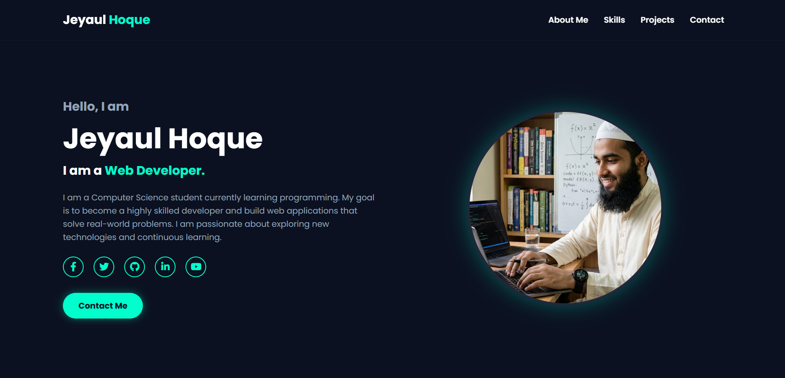

# 👨‍💻 Full Stack Web Developer
### 🇧🇩 Based in Bangladesh

  
  

---

### 💫 আমার সম্পর্কে (About Me)
- 👋 হাই, আমি **জাবের**, বাংলাদেশ থেকে একজন প্যাশনেট **ওয়েব ডেভেলপার**।
- 🚀 আমি একটি ওয়েবসাইট তৈরি করতে যা যা প্রয়োজন—**Frontend থেকে Backend**—সবকিছুতেই দক্ষ।
- 🛠️ পিক্সেল-পারফেক্ট ডিজাইন এবং ক্লিন কোড লেখা আমার নেশা।
- 🌍 আমার লক্ষ্য হলো আধুনিক এবং ইউজার-ফ্রেন্ডলি ওয়েব এক্সপেরিয়েন্স তৈরি করা।

---

### 🛠️ আমার দক্ষতা (My Tech Stack)
একটি ওয়েবসাইট তৈরি করতে প্রয়োজনীয় সকল টেকনোলজিতে আমার হাত পাকানো আছে:

<table align="center">
  <tr>
    <td align="center" width="96">
      
       HTML5
    </td>
    <td align="center" width="96">
      
       CSS3
    </td>
    <td align="center" width="96">
      
       JavaScript
    </td>
    <td align="center" width="96">
      
       React
    </td>
    <td align="center" width="96">
      
       Tailwind
    </td>
  </tr>
  <tr>
    <td align="center" width="96">
      
       Node.js
    </td>
    <td align="center" width="96">
      
       MongoDB
    </td>
    <td align="center" width="96">
      
       Git
    </td>
    <!-- <td align="center" width="96">
      
       Figma
    </td> -->
    <td align="center" width="96">
      
       VS Code
    </td>
  </tr>
</table>

---

### 📊 গিটহাব স্ট্যাটাস (GitHub Stats)

  <!--  -->
  

---

### 📫 Click the icon below to contact me 👇🏻

---
